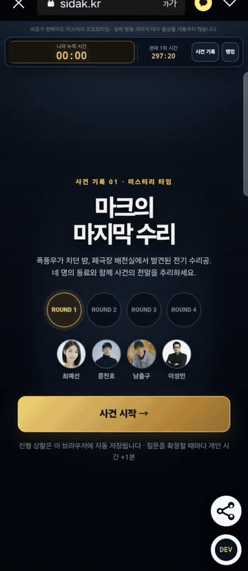
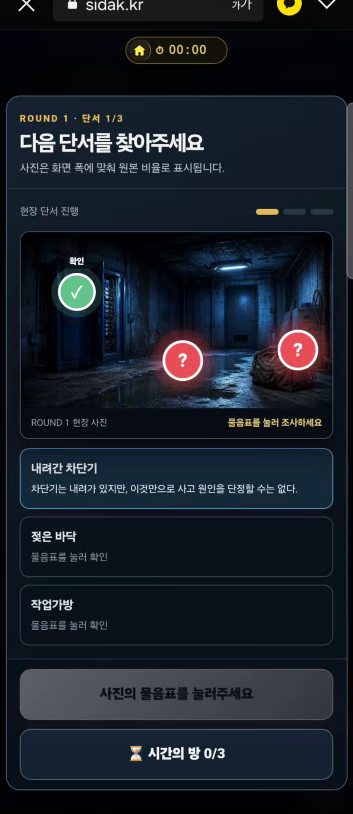
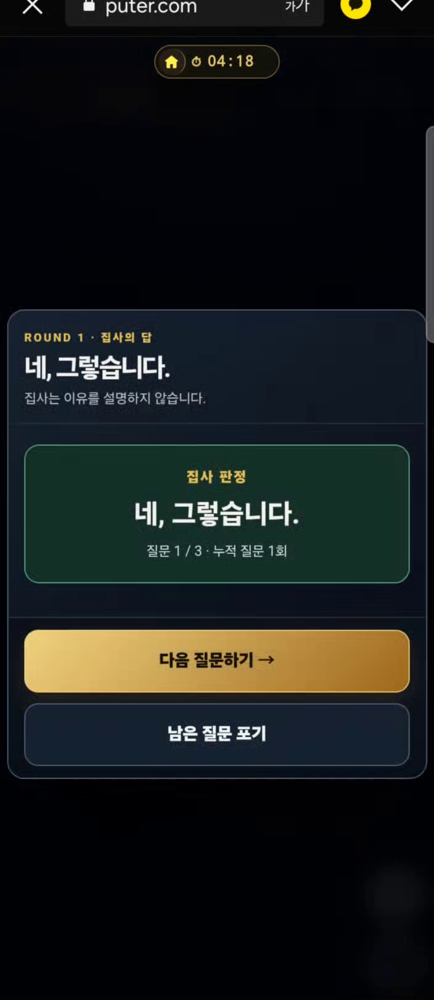

# 마크의 마지막 수리

> 피의게임 X를 보고 팬의 마음으로 만든 비공식 AI 미스터리 팬 프로젝트  
> 기획부터 코드, 디버깅과 이미지 제작까지 GPT와 대화하며 바이브코딩으로 완성했습니다.

이 프로젝트의 개발 소스는 공개됩니다. 코드를 잘 몰라도 이 저장소를 출발점으로 삼아 새로운 사건, 장소, 등장인물과 규칙을 AI에게 설명하고 자신만의 미스터리 테마를 만들어 보세요.

- 게임 플레이: https://sidak.kr/autodev/GameCreator/crimeGame/
- 개발자 정보: https://sidak.kr/autodev/GameCreator/crimeGame/developer.html
- 개발 기록: https://www.threads.com/@watercastlegames?hl=ko

<p align="center">
  
</p>

<details>
  <summary><b>사건 시작부터 AI 판정까지 26초 하이라이트 보기</b></summary>
  <br>
  <p align="center">
    
  </p>
</details>

## 어떤 게임인가요?

사진과 공개 단서를 조사하고, AI 동료와 의견을 나누고, 집사에게 질문하며 사건의 전말을 완성하는 모바일 중심 추리 게임입니다.

각 라운드에서 정보를 더 얻을수록 개인 시간이 늘어납니다. 정확한 질문을 설계해 사건을 빨리 해결할지, 시간의 방에서 추가 힌트를 얻고 안전하게 추리할지 선택해야 합니다.

1. 사건 개요 확인
2. 새로운 현장 사진 공개
3. 사진 속 단서 3개 조사
4. AI 동료의 의견과 추천 질문 확인
5. 집사에게 최대 3개의 질문
6. 필요하면 시간의 방에서 추가정보 획득
7. 네 번의 라운드 후 최종 발의
8. 항목별 정답 판정, 사건의 전체 내막과 기록 공개

## 주요 장면

| 사건 시작 | 현장 단서 |
|---|---|
|  |  |

| 시간의 방 | AI 집사 판정 |
|---|---|
|  |  |

## 핵심 기능

- 네 라운드로 이어지는 사진 중심 사건 전개
- 라운드마다 현장 단서 3개와 시간의 방 추가정보 3개
- 현재까지 공개된 정보만 사용하는 AI 동료 의견
- `네, 그렇습니다`, `아니요, 그렇지 않습니다`, `그럴 수도 있습니다`, `중요하지 않습니다`의 AI 집사 판정
- 질문과 힌트 사용량에 따라 늘어나는 개인 시간
- 피해자·가해자·장소·사망 원인·동기·숨겨진 진실의 항목별 최종 평가
- 브라우저 로컬 진행 저장과 새로고침 복구
- Firebase Google 로그인, 사건당 1회 기록과 공개 랭킹
- 모바일과 PC에 대응하는 중앙 팝업형 진행

## 빠르게 실행하기

Puter.js는 보안상 `file://` 주소에서 실행되지 않습니다. 반드시 로컬 웹서버로 열어야 합니다.

```bash
python -m http.server 8080
```

브라우저에서 다음 주소를 엽니다.

```text
http://localhost:8080/
```

정적 서버만으로도 개인 기록 모드와 Puter AI 기능을 체험할 수 있습니다. Google 로그인과 공용 랭킹을 사용하려면 [Firebase 설정 안내](docs/guides/FIREBASE_SETUP.md)를 따라 별도 프로젝트를 연결하세요.

## 기술 구성

- UI: HTML, CSS, Vanilla JavaScript
- AI: Puter.js AI Chat
- 현재 AI 후보 모델: `gpt-5.4-nano`, `gpt-5-nano`
- 로그인·랭킹: Firebase Authentication, Cloud Firestore
- 로컬 저장: Web Storage
- 이미지: GPT 이미지 생성과 게임용 후처리
- 개발 방식: GPT와 대화하는 바이브코딩

## 프로젝트 구조

```text
crimeGame/
├─ index.html                 # 게임 진입점
├─ developer.html             # 개발자·오픈소스 소개
├─ assets/
│  ├─ css/                    # 게임과 개발자 페이지 스타일
│  ├─ js/                     # 사건 데이터, AI, 상태, Firebase, UI
│  ├─ images/                 # 라운드·결말 이미지와 아이콘
│  └─ media/                  # GitHub용 플레이 GIF
├─ docs/
│  ├─ design/                 # 게임 기획서·상세 설계서·개선 보고서
│  ├─ guides/                 # 테마 제작·Firebase·배포 안내
│  ├─ images/                 # 공개용 플레이 스크린샷
│  ├─ project/                # 팬 프로젝트·에셋·공개 범위 안내
│  └─ release/                # GitHub·Threads 공개 준비 문서
├─ firestore.rules            # Firestore 보안 규칙
└─ README.md
```

## 나만의 사건으로 바꾸기

가장 중요한 파일은 다음 세 개입니다.

- `assets/js/case-data.js`: 사건 개요, 네 라운드, 단서, 시간의 방, 결말
- `assets/js/puter-ai.js`: 동료 성격, 공개 범위, 사건 확정 사실과 질문 판정 규칙
- `assets/js/final-evaluation.js`: 최종 발의의 정답과 부분정답 기준

구체적인 수정 순서와 AI에게 전달할 바이브코딩 프롬프트는 [새 테마 제작 가이드](docs/guides/CUSTOM_THEME_GUIDE.md)에 정리했습니다.

## 소스 빌드

모듈 소스를 수정한 뒤 현재 배포용 번들을 다시 만들 수 있습니다.

```bash
npx --yes esbuild assets/js/app-round11.js \
  --bundle \
  --format=iife \
  --target=es2020 \
  --outfile=assets/js/game-round54.bundle.js
```

다른 파일명을 사용한다면 `index.html`의 번들 주소도 함께 변경하세요.

## 공개와 기여

소스 코드는 MIT License로 공개됩니다. 버그 수정, 모바일 개선, 새로운 사건 구조와 문서 보완을 환영합니다.

- [문서 전체 목차](docs/README.md)
- [새 테마 제작 가이드](docs/guides/CUSTOM_THEME_GUIDE.md)
- [기여 안내](CONTRIBUTING.md)
- [공개 파일 범위](docs/project/OPEN_SOURCE_MANIFEST.md)
- [이미지·아이콘 사용 안내](docs/project/ASSET_NOTICE.md)
- [보안 제보 안내](SECURITY.md)

## 팬 프로젝트 안내

이 프로젝트는 피의게임 X를 재미있게 본 팬이 애정을 담아 만든 비공식 팬게임이며 방송사, 제작진, 출연자와 공식적인 관련이 없습니다. 방송 영상이나 공식 이미지를 사용하지 않으며, 게임 속 인물과 이미지는 가상 설정으로 재구성했습니다.

자세한 내용은 [팬 프로젝트 고지](docs/project/FAN_PROJECT_NOTICE.md)를 확인하세요.

## 개발자의 다른 게임

### SON 키우기 타이쿤 : 아들을 축구 월클선수로

아들을 훈련시키고 커리어를 성장시켜 세계적인 축구 선수로 키우는 모바일 육성 타이쿤 게임입니다.

[Google Play에서 보기](https://play.google.com/store/apps/details?id=com.SonFootballerTycoon.WaterCastleGames&hl=ko)

---

Made with vibe coding by [Water Castle Games](https://github.com/watercastlegames) · [Public source repository](https://github.com/watercastlegames/mark-last-repair)
